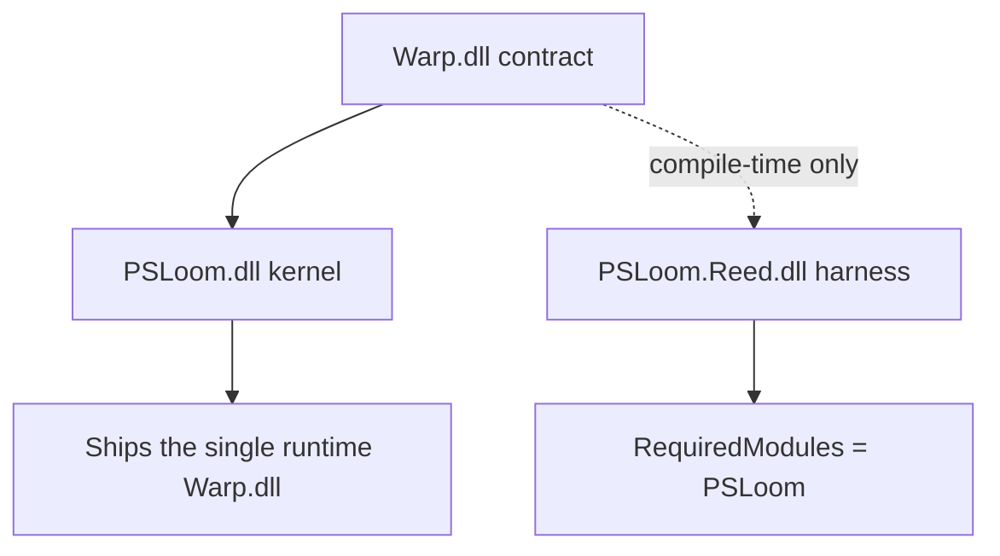

PSLoom gives PowerShell 7.6+ the shell ergonomics of zsh and fish — a declarative profile, styles, hooks, parameterized
aliases, and completion for native commands — as a small kernel plus harnesses that plug into it.

This document describes how the pieces fit and where each rule is enforced. The design record, with every decision
and its alternatives, is the design record; the rules that must never regress are in [invariants.md](invariants.md);
writing a harness is covered in [harness authoring](../contributing/harness-authoring.md).

## Assemblies and dependency rules



- **Warp** depends only on `System.Management.Automation`, as a reference. Its `AssemblyVersion` is the contract major
  (`1.0.0.0`), so additive kernel releases stay binding-compatible, and PublicAPI analyzers fail the build on an
  unintended surface change.
- **The kernel** references Warp normally and ships `Warp.dll` in its module folder.
- **A harness** references Warp with `PrivateAssets="all" ExcludeAssets="runtime"` and never references the kernel. Two
  copies of Warp in one process would load identically named, non-convertible types, so every harness binds to the
  kernel's copy.

Enforced by `Warp.Tests.Architecture.WarpDependencyTests`, `PSLoom.Reed.Tests.Architecture.HarnessDependencyTests` and,
in a real process, `PSLoom.Reed.Integration.Tests.PublishedModuleTests.OnlyTheKernelsCopyOfWarpIsLoaded`.

## How a harness reaches the kernel

`HarnessHost` is a static facade in Warp. When the kernel module is imported, `ModuleInitializer.OnImport` attaches the
kernel's implementation through an internal `IKernel` (Warp grants `InternalsVisibleTo("PSLoom")`), subscribes the
engine's `Exiting` event, and captures `$ExecutionContext` for the hook wiring — the runspace proxy is unusable while
an import pipeline runs, so it is captured by running a script on the importing thread.

A harness module calls `HarnessHost.Register<THarness>()` from its own `OnImport`. The kernel checks the `[Harness]`
attribute and the contract major the harness was compiled against, then composes it: `IHarness.Compose` receives an
`IHarnessBuilder` scoped to that harness and that runspace. Its cmdlets later reach the same capabilities through
`HarnessHost.Current<THarness>()`.

Nothing scans assemblies. A harness that fails to compose is rolled back: its verbs and published APIs are removed.

## State lives per runspace

Every store is keyed by `Runspace` in a `ConditionalWeakTable` (`RunspaceLocal<T>` in the kernel, `ReedSession` in
Reed): it lives exactly as long as its runspace, never leaks into another, and needs no cleanup.

| Store            | Holds                                                                                                |
| ---------------- | ---------------------------------------------------------------------------------------------------- |
| `StyleStore`     | style definitions, per-name resolution caches, watchers                                              |
| `HookBus`        | handler snapshots per hook kind, the wiring state, the trace log                                     |
| `LoomSession`    | the verb registry, composed harnesses, runs in progress, the last draft's timings and reweave ledger |
| `TreadleCatalog` | treadle definitions                                                                                  |
| `ReedSession`    | completers, providers, the completion cache, wired names, the trace log                              |

`LoomSession` is created on first use rather than at import, which keeps `Import-Module PSLoom` under its budget.

Callbacks that may run on another thread — PSReadLine handlers, engine events — capture the store (and so the
runspace) when they are registered, instead of reading `Runspace.DefaultRunspace` when they run.

## The draft pipeline

```mermaid
sequenceDiagram
    participant User as Profile
    participant Host as Invoke-Loom
    participant Modules as Harness provisioner
    participant DSL as Scoped verbs
    participant Queue as Shed queue
    User->>Host: Draft
    Host->>Host: Prepass Thread and Shed
    Host->>Modules: Import/install first-party harnesses
    Modules-->>Host: Compose verbs and services
    Host->>Host: Validate scopes (abort on errors)
    Host->>DSL: Execute rewritten draft
    DSL->>Queue: Capture deferred statements
    DSL-->>Host: Collected errors and timings
    Host-->>User: Report errors; SessionStarting on first weave
    Note over Queue: PrePrompt / Idle slices, missed-command drain,<br/>or non-interactive draft-end drain
```

`Invoke-Loom -Draft { … }` runs a profile once per session:

1. **Prepass.** `DraftAnalyzer` walks the AST for `Thread` calls. `Thread` must be a top-level statement with a literal
   name (and literal `-Version`), so harness loading is unconditional and visible before anything runs.
2. **Provisioning.** `HarnessProvisioner` imports `PSLoom.<Name>` for each thread. Only first-party harnesses are
   accepted. A missing one is installed from PSGallery for the current user, under a cross-session lock under the
   Creel; nothing is ever updated implicitly (`Update-Harness` does that). `-Validate` never installs.
3. **Validation.** `DraftValidator` walks the AST again with scope tracking through `[OpensScope]` parameters. A verb
   outside its scopes is an error naming the verb, the valid scopes and the position. Any error from steps 1–3 blocks
   execution: nothing runs.
4. **Staging.** When the draft uses `Shed`, the host rewrites it before running: a statement staged with `-Wait` or `-Slot` becomes
   a capture call, a statement with only conditions or output modifiers is wrapped in an admit/applied guard, and every
   replacement keeps its lines. Captured statements wait in a slot-ordered queue that internal `PrePrompt` and `Idle` handlers
   drain in 15 ms slices, that a missed command drains entirely, and that a non-interactive host drains at the end of the draft.
   `Get-Shed` shows each staged statement and what became of it.
5. **Execution.** The draft runs once through `InvokeWithContext` with the root scope's verb table. Each verb is a
   `LoomVerb` cmdlet reached through a shim; its lifecycle is sealed so every failure goes to the run's error channel.
   A body opening a nested scope runs with that scope's table, so a verb is only callable where it is valid.
6. **Error channel.** Each run owns a `LoomRun`. Failures are collected and written once, as non-terminating errors of
   `Invoke-Loom`, after execution; a failing verb never aborts the rest of the draft.
7. **Completion.** The session is marked woven and `SessionStarting` is raised. A second `Invoke-Loom` is a no-op.

`Invoke-Loom -Reweave` re-applies an edited draft. Each top-level verb that completed without error is recorded in a
ledger by key (verb name plus `[ReweaveKey]` values) and fingerprint (128 bits of SHA-256 over its canonicalized bound
parameters). An unchanged invocation is skipped, a changed or new one runs, and a removed one is reverted when its verb
implements `IRevertibleVerb` — or reported as needing a restart when it does not. Statements that are not verbs always
run again.

`Measure-Loom` reports the last run's phases and per-verb inclusive and exclusive time.

## Styles

A style is a value under a `(context pattern, name)` key. Resolution picks, among the patterns matching a concrete
context, the one with the longest literal prefix; ties go to the most recent definition. Each name keeps its definitions
pre-sorted and caches `context → winner`, so a cache hit allocates nothing. Watchers run after a write commits, each
isolated from the others, with recursion bounded. A concrete watcher fires when what its context resolves to changes; a
pattern watcher fires on any write its pattern matches. With replay, a concrete watcher receives the current value and a
pattern watcher receives every stored definition it matches, so a harness toggled by styles starts from what the profile
already set.

## Hooks

`Register-Hook` subscribes a handler to a hook kind (`DirectoryChanged`, `PrePrompt`, `PreExecute`, `CommandNotFound`,
`Idle`, `SessionStarting`, `SessionExiting`). A kind is wired the first time a handler registers for it — wrapping
`prompt`, chaining `LocationChangedAction` or `CommandNotFoundAction`, installing a PSReadLine `LineAcceptedHandler`
after a capability probe, or subscribing an engine event under the event's own name as source identifier. Wiring is
never unwound. Dispatch reads an immutable snapshot, so a kind with no handlers costs a length check. Bridges called by
the engine or PSReadLine never throw.

## The Creel

The Creel is the storage root: `$env:LOOM_HOME`, else `%LOCALAPPDATA%\Loom` on Windows, else `$XDG_DATA_HOME/loom`,
else `~/.local/share/loom`. Each harness gets `harnesses/<Name>/`; the kernel uses `kernel/`. `CreelPath` is the only way
to name a path under it, and it rejects rooted input, traversal out of the root, and links pointing outside. This
guards against accidents, not against the harness: a harness is full-trust in-process code.

## Treadles

A treadle is a name bound to a command with arguments baked in. Its body is parsed once, at creation, into a target
command and constant tokens, and installed as a global function equivalent to `& <command> <baked> @args`. Collisions
are checked against functions, aliases and cmdlets through table reads, never command discovery. Harnesses observe the
catalog through `ITreadleCatalog`.

## Reed: completion for native commands

```text
Sley / New-Completer ──► CompleterDefinition ──► validation gate ──► CompiledCompleter ──► registry
                                                                                             │
Tab ──► TabExpansion2 ──► native completer (one shared script block) ──► ReedBridge ◄────────┘
                                                                            │
                     TokenClassifier ──► ContextResolver ──► CompletionEngine ──► sources, providers, cache
```

- **Declaring.** `Sley` (in a draft) or `New-Completer` (from a module) runs the declaration body with Reed's scopes —
  `Command`, `Option`, `Argument`, `OptionGroup`, `Use` — building a `CompleterDefinition`. `Register-Completer` and
  `Sley` pass it through the same validation gate: warnings are written and the completer registers; errors block it.
- **Compiling.** At registration the tree becomes a `CompiledCompleter`: case-insensitive lookups for subcommand and
  option names, and ordinal-sorted candidate arrays filtered by binary search.
- **Wiring.** Every name and alias is registered once with `Register-ArgumentCompleter -Native`, all sharing one script
  block that marshals into `ReedBridge.Complete`. Unregistering drops the registration; the wiring stays.
- **Resolving.** The bridge extracts the typed tokens (without the command name and the word in progress), walks them
  to the active command, the bound options and the expected value slot, and produces candidates: subcommands, options,
  and whatever the slot's source returns. A treadle's baked tokens are prepended first, so `glog` completes like
  `git log --oneline` would.
- **Sources.** An inline `-Source` script block or a `-Provider` registered by name receives the word, the command
  path, the bound options and the positional arguments. `-CacheKey` reuses an answer while its key holds.
- **Portability.** `Export-Completer` writes JSON with a schema number; only provider-backed sources travel.
- **Safety.** The bridge catches every failure, returns nothing, and records the press for `Trace-Completion`.

## Errors and diagnostics

Every exception derives from `PowerShellException` and carries an error id with its owner's prefix. Cmdlets catch
and write non-terminating errors; they never tear down the caller's pipeline. `Trace-Hook`, `Trace-Style` and
`Trace-Completion` read bounded ring buffers (200 entries by default, oldest dropped first); a harness gets its own
through `IDiagnostics.CreateLog<TEntry>`.

## Performance budgets

Budgets cover the steady state, with every harness already installed, and CI enforces them on medians with a 1.2
noise tolerance:

| Metric                                                         | Budget                 | Enforced by                                          |
| -------------------------------------------------------------- | ---------------------- | ---------------------------------------------------- |
| `Import-Module PSLoom`                                         | < 50 ms                | `benchmarks/Measure-Startup.ps1`, all CI runners     |
| Typical draft (`benchmarks/drafts/typical.ps1`, Reed threaded) | < 150 ms over import   | same                                                 |
| Style resolve, cache hit                                       | < 50 ns, 0 allocations | `benchmarks/Assert-Budgets.ps1`, Ubuntu job          |
| Hook dispatch, no handlers                                     | < 10 ns, 0 allocations | same                                                 |
| Reed Tab on the medium completer                               | < 5 ms                 | same, plus `CompletionBudgetTests` in the test suite |

Most of a typical draft's time is PowerShell's own first-call cost: importing the harness module and the first
invocation of each verb type. A second completer declaration in the same draft costs a few milliseconds.

## Repository ownership

Kernel, Warp and their tests live in [PSLoom/PSLoom](https://github.com/PSLoom/PSLoom). All Reed tests, including HarnessDependencyTests and OnlyTheKernelsCopyOfWarpIsLoaded, live in [PSLoom/Reed](https://github.com/PSLoom/Reed). Kernel startup budgets use Fixture; Reed owns the typical draft and completion budgets. See [repositories](../contributing/repositories.md).
