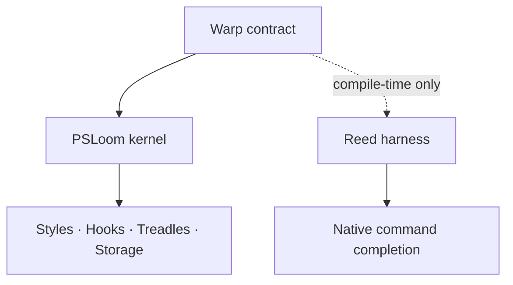

## What PSLoom is

PSLoom gives PowerShell 7.6+ a declarative profile, context-sensitive styles, lifecycle hooks, parameterized command shortcuts, and completion for native commands. A profile is a **draft**, executed by `Invoke-Loom` once per session.

## Kernel and harnesses

The kernel owns the draft lifecycle and shared services. Harnesses add features using the Warp contract. Only the kernel ships Warp at runtime.

## Harnesses

| Harness                          | Purpose                            | Status                               |
| -------------------------------- | ---------------------------------- | ------------------------------------ |
| [Reed](modules/reed/overview.md) | Declarative native completion      | Implemented; gallery release pending |
| [Colorway](modules/colorway.md)  | Command-aware syntax highlighting  | Planned                              |
| [Weft](modules/weft.md)          | Plugin management                  | Planned                              |
| [Shuttle](modules/shuttle.md)    | Release assets, binaries and shims | Planned                              |

## Where to go next

Start with [installation](getting-started/installation.md) and [your first draft](getting-started/first-draft.md). Explore the [kernel reference](modules/psloom/reference.md), [Reed reference](modules/reed/reference.md), or [architecture](architecture/overview.md). Contributors can follow the [development setup](contributing/development-setup.md).
